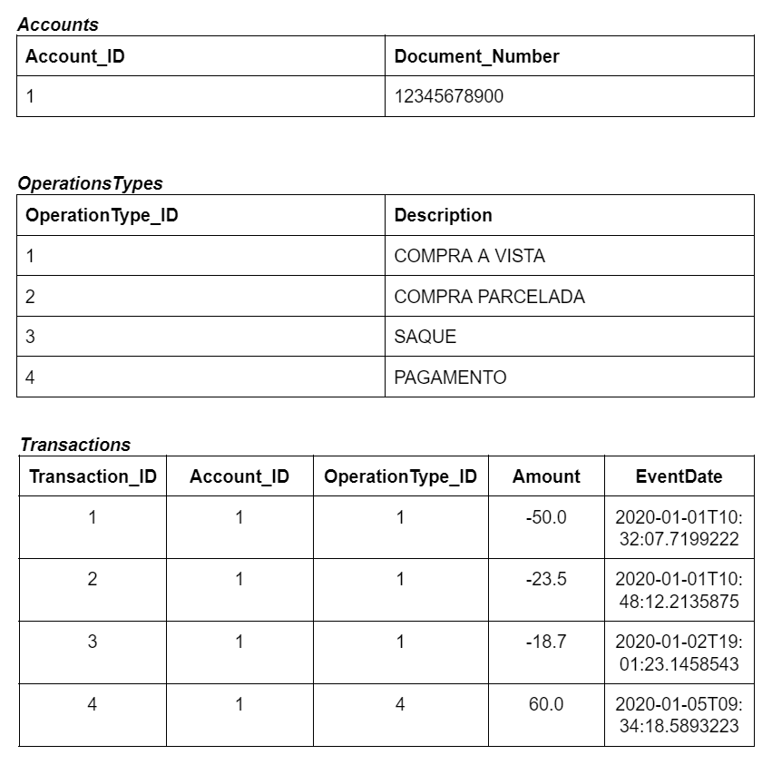
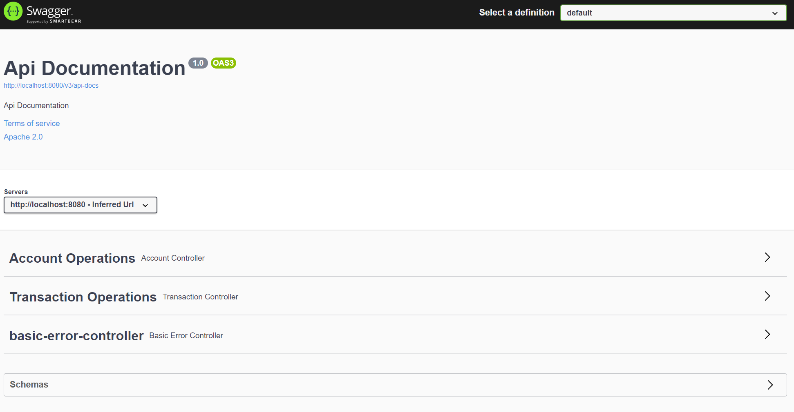
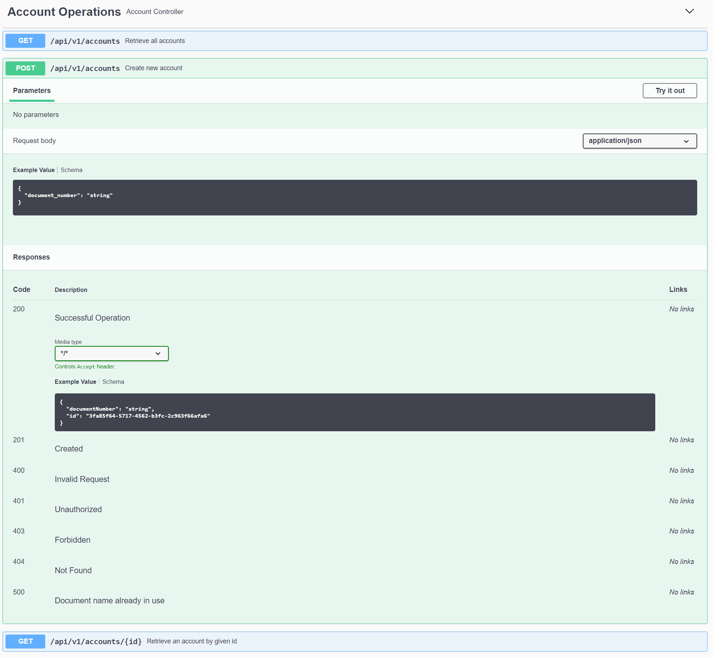
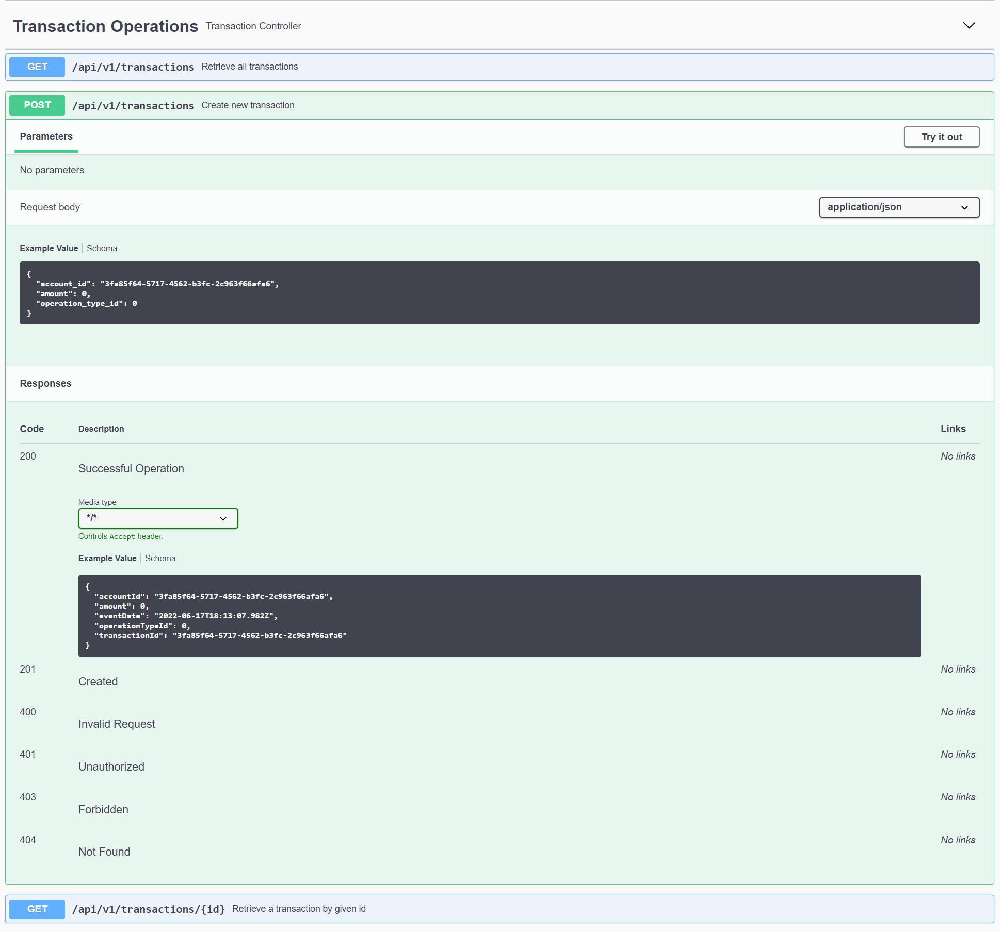
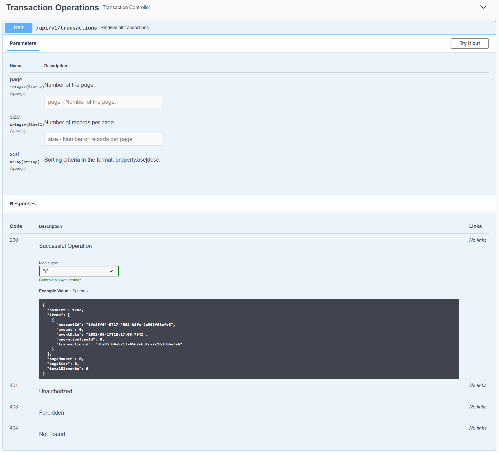

# Payment Processing API

API that processes credit card transactions.

# Description

Each cardholder (customer) has an account with their data. For each operation performed by the customer, a transaction
is created and associated with their respective account. Each transaction has a type (purchase, installment purchase,
withdrawal or payment), an amount and a creation date. Purchase and withdrawal type transactions are recorded with a
negative value, while payment transactions are recorded with a positive value.

# Data structure

The data structure of the API can be checked in the image below:



## Caching

Each Transaction must have a valid operation type. Since the operation types are always the same, it makes sense to
cache those values to avoid unnecessary calls to the database, and also improve performance.

With that in mind, the result is cached in memory and has expiration time of 1 minute.
The expiration time is configurable in application properties.

```yaml
cache:
  expiration-time: 60   # in seconds. Default is 1 min.
```

---

# How to run?

You can run this project in different ways:

### Docker

The project's image can be pulled
from [Docker Hub](https://hub.docker.com/repository/docker/gabriellorandi96/payment-processing).

Or simply using the **docker pull** command:

```
docker pull gabriellorandi96/payment-processing
```

And run the command:

```
docker run -p 8080:8080 gabriellorandi96/payment-processing:latest
```

### IDE

Requirements:

- Java 11
- Maven
- A Java IDE

The project should be imported as **maven project** from your IDE, and then run.

---

# Using the API

With the project running locally, the swagger-ui Api Documentation can be accessed on: <http:localhost:8080/swagger-ui/>



### Account

An account can be created using the POST method explained in  **Account Operations**.

Body example:

```json
{
  "document_number": "12345678900"
}
```

As shown in the image below:



There's also a GET method to get all accounts.

### Transaction

After creating an account and having its id, Transactions can be created using **Transaction Operation's** POST
endpoint.



Body example:

```json
{
  "account_id": "391ce7c1-1543-4d24-b6d3-58de25049ade",
  "operation_type_id": 3,
  "amount": 123.45
}
```

If it's a successful request, here is an example of a response:

```json
{
  "transactionId": "8c1c69c0-f8c0-4628-9617-64e1a4af5107",
  "accountId": "391ce7c1-1543-4d24-b6d3-58de25049ade",
  "operationTypeId": 3,
  "amount": 123.45,
  "eventDate": "2022-06-17T18:18:30.1638279Z"
}
```

There's also a GET endpoint to get all transactions using **Transaction Operations**, as shown below:



Response:

```json
{
  "hasNext": false,
  "pageSize": 20,
  "pageNumber": 0,
  "totalElements": 1,
  "items": [
    {
      "id": "391ce7c1-1543-4d24-b6d3-58de25049ade",
      "documentNumber": "12345678900"
    }
  ]
}
```

---

# Technical Notes

## Stack

This project uses the following stack:

- Java 11
- Spring 2.5.1
- Maven

Some Dependencies used:

- H2 for embedded database
- Flyway for database migration
- Swagger (SpringFox) for API documentation

## Plugins

This project uses JIB maven plugin from Google to generate a docker image and push to Docker HUb.

Documentation [here](https://github.com/GoogleContainerTools/jib/tree/master/jib-maven-plugin).

The command to use the plugin is:

```
mvn compile jib:build
```

# Problem with Pageable and Swagger

There is a known [issue](https://github.com/springfox/springfox/issues/2623)
with Swagger trying to deserialize Pageable entity.

The workaround was creating an annotation that configures the pagination attributes of Swagger and uses it together
with @ApiIgnore annotation to ignore the Pageable attributes.

ApiPageable interface:

```java
@Target({ElementType.METHOD, ElementType.ANNOTATION_TYPE, ElementType.TYPE})
@Retention(RetentionPolicy.RUNTIME)
@ApiImplicitParams({
        @ApiImplicitParam(name = "page", dataTypeClass = Integer.class, paramType = "query", value = "Number of the page."),
        @ApiImplicitParam(name = "size", dataTypeClass = Integer.class, paramType = "query", value = "Number of records per page."),
        @ApiImplicitParam(name = "sort", allowMultiple = true, dataTypeClass = String.class, paramType = "query", value = "Sorting criteria in the format: property,asc|desc.")
})
public @interface ApiPageable {
}
```

Usage:

```java
@RestController
public class ExampleController {
    @ApiPageable
    @GetMapping
    public ResponseEntity<Void> usageExample(@ApiIgnore Pageable pageable){
        return ResponseEntity.noContent().build();
    }
}
```